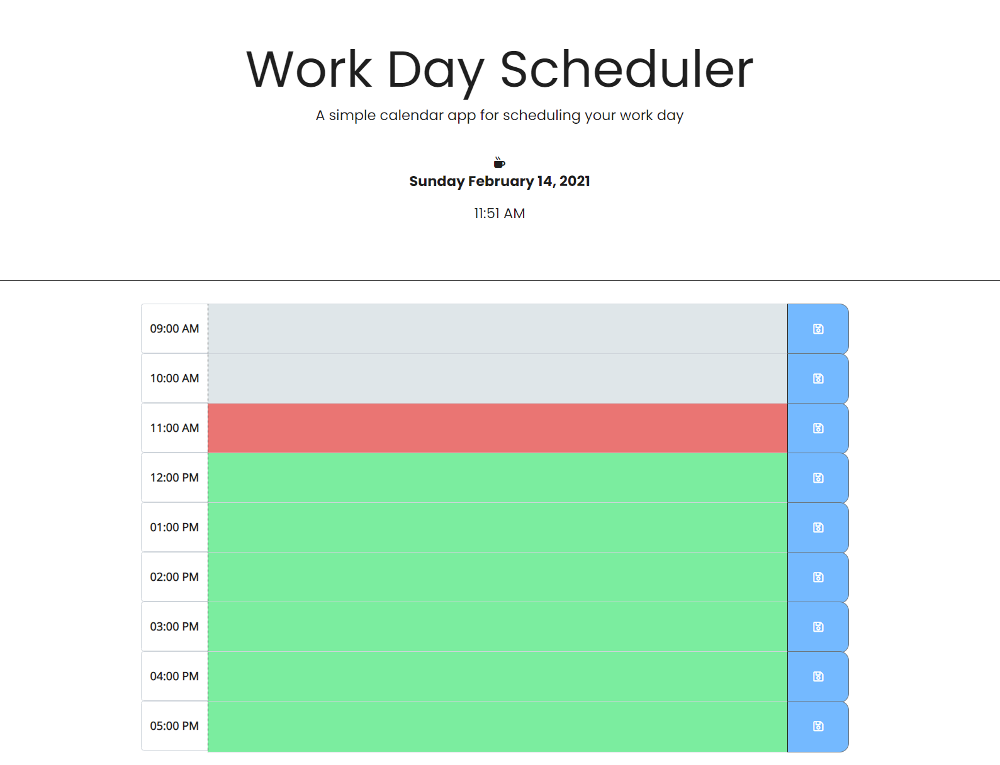

# 📆 Work Day Scheduler

A simple calendar application that allows the user to save events for each hour of the day. This app will run in the browser and feature dynamically updated HTML and CSS powered by jQuery and Moment.js.

## Starter Code
https://github.com/coding-boot-camp/super-disco

## Functionality
* When the planner is openned, the current day is displayed at the top of the calendar
* When scrolled down, the user is presented with time blocks for standard business hours (from 9AM to 5PM)
* When the user views the time blocks for that day, each time block is color-coded to indicate whether it is in the past, present, or future
  *  `Past` 
  *  `Present`
  *  `Future` 
* Then the user can click into a time block and enter an event
* When clicked on the save button on the right for that time block, then the text for that event is saved in local storage
* When the page is refreshed, the saved events persist

## Deployment
Workday Schedule App: https://sadiqmomin.github.io/Workday-Schedule/

## Built With

  * HTML
  * CSS
  * JavaScript
  * jQuery
  * Moment.js